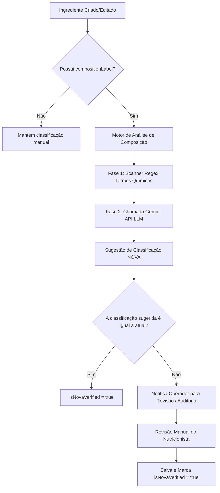

# ADR 0002: Classificação Automática e Auditoria do Rótulo Nutricional NOVA

## Status
Aprovado (Accepted)

## Contexto
O Guia Alimentar para a População Brasileira utiliza a classificação **NOVA** para dividir os alimentos em quatro grupos com base no nível de processamento industrial:
1. **Grupo 1 (Alimentos in natura ou minimamente processados)**: Frutas, legumes, verduras, carnes, leite.
2. **Grupo 2 (Ingredientes culinários processados)**: Sal, açúcar, óleos, manteiga.
3. **Grupo 3 (Alimentos processados)**: Queijos tradicionais, pães artesanais, conservas.
4. **Grupo 4 (Alimentos ultraprocessados)**: Margarinas, refrigerantes, aditivos químicos, corantes, essências artificiais.

Para manter a confiabilidade das receitas na plataforma **Empada Cearense**, cada ingrediente cadastrado precisa de uma classificação precisa. Atualmente, o chef ou operador insere essa informação manualmente. No entanto, o preenchimento incorreto pode gerar erros em cascata nos rótulos de ultraprocessados das receitas finais.

Por outro lado, o rótulo descritivo de ingredientes (`compositionLabel`) contém a verdade factual sobre a composição. Uma análise automatizada desse texto pode prever com alta precisão o nível de processamento.

---

## Decisão de Arquitetura

Propomos uma arquitetura baseada em **inteligência artificial generativa assíncrona** aliada a um **fluxo de curadoria humana** para automatizar a classificação NOVA:



### 🧬 Componentes Técnicos

1. **Atributo `isNovaVerified`:**
   - Campo booleano persistido no banco de dados (`Prisma`).
   - Indica se a classificação atual foi validada por um profissional humano ou se o motor de IA confirmou com alta fidelidade a correspondência da classificação.

2. **Fase 1: Pré-Filtro Determinístico (Regex Rule Engine):**
   - Um scanner baseado em expressões regulares busca aditivos típicos do Grupo 4 (ex: `"gordura hidrogenada"`, `"xarope de milho"`, `"realçador de sabor"`, `"corante artificial"`, `"emulsificante"`, `"espessante xantana"`, `"carboximetilcelulose"`).
   - Se houver correspondência, o motor pré-classifica como **NOVA_4 (Ultraprocessado)**.

3. **Fase 2: Classificação Semântica via IA (Gemini API):**
   - Um microsserviço ou classe auxiliar (`NovaScannerService`) faz chamadas à API do **Google Gemini** passando o texto do rótulo.
   - **System Prompt sugerido:**
     ```text
     Você é um assistente especialista em nutrição e classificação alimentar NOVA. 
     Analise a seguinte lista de ingredientes comercializada em um rótulo industrializado:
     "${compositionLabel}"
     
     Classifique o alimento estritamente em uma das quatro categorias NOVA:
     - NOVA_1: Alimento in natura ou minimamente processado (ex: farinhas puras, vegetais, carnes, grãos).
     - NOVA_2: Ingrediente culinário processado (ex: sal, açúcar, óleo, gorduras).
     - NOVA_3: Alimento processado (ex: queijos tradicionais, compotas, conservas simples).
     - NOVA_4: Alimento ultraprocessado (ex: corantes, emulsificantes, conservantes químicos, adoçantes, xaropes).
     
     Retorne exclusivamente um JSON estruturado com o formato:
     {
       "novaClassification": "NOVA_1" | "NOVA_2" | "NOVA_3" | "NOVA_4",
       "confidence": 0.0 a 1.0,
       "justification": "Explicação concisa do porquê desta classificação"
     }
     ```

4. **Fluxo de Curadoria (Revisão):**
   - O painel administrativo exibe um ícone visual (ex: ⚠️ ou ✅) baseado no campo `isNovaVerified`.
   - Se o motor de IA discordar da classificação informada no cadastro inicial, um alerta de divergência nutricional é gerado, permitindo que o operador revise e aprove a sugestão da IA com um clique, atualizando o campo `isNovaVerified` para `true`.

---

## Consequências

- **Pontos Positivos (+):**
  - **100% de Conformidade:** Garante que receitas contendo aditivos ocultos ou ultraprocessados não sejam vendidas falsamente como saudáveis.
  - **Fração de Erro Reduzida:** Diminui drasticamente erros de input humano no cadastro de ingredientes.
  - **Experiência Premium:** Oferece ao usuário um preenchimento automático sugerido ao digitar a composição do rótulo.

- **Pontos de Atenção (-):**
  - **Custo de Chamada de API:** Chamadas síncronas/assíncronas dependem de cotas ou conexões de rede externas. Mitiga-se isso fazendo cache local das palavras-chave em tabelas de suporte e executando a classificação apenas na criação ou quando a composição textual for modificada.
